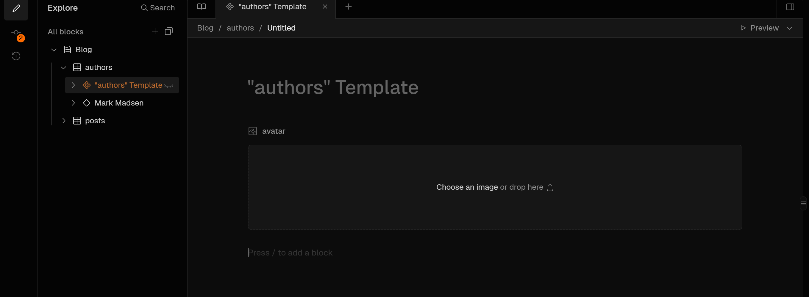
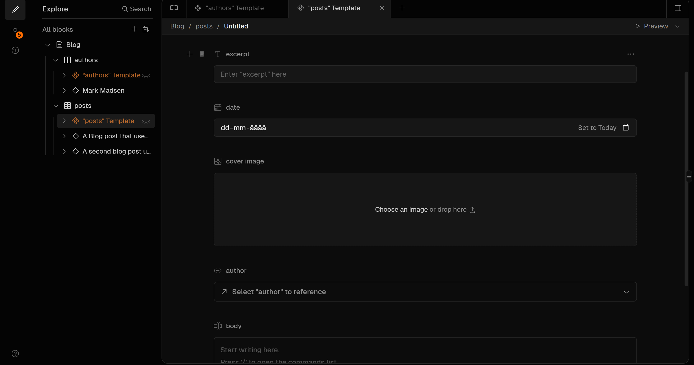

# Start using Fresh with Basehub

What is https://basehub.com?...

BaseHub.com is an AI-native headless CMS designed for fast, collaborative content management. It leverages artificial intelligence to streamline content creation and delivery, offering a user-friendly interface and efficient workflows. BaseHub supports GraphQL for content delivery and provides a type-safe SDK for seamless integration into web applications, making it a modern solution for content teams.


## First thing first...

### 1. Create an account and a repository on BaseHub

First, [create an account on BaseHub](https://basehub.com/signup/).

After creating an account, create a new blank **repository** from the [dashboard](https://basehub.com/) and assign to it any name of your liking.

### 1. Create new Document Block

The [Document Block](https://basehub.com/docs/basics/content-modeling-with-blocks#document) is like a page inside BaseHub. 

For this example you need to create a Block that defines an author and a post collection with its content type, you can call it **Blog**. Once you have created the document, you can add fields to it. 


#### Create an `Authors` collection with its content type

From your BaseHub repository, in the **Content** tab, create a new **collection** from **Blog** document:

Give it the **title** `Authors`, the **API Name** should be `authors`



Once the collection is saved, go to **Edit template** and start with a **Image** field block. Call it `avatar` and set it up **Is Required** constraint.

Save the content type and continue.


#### Create a `Posts` collection with its content type

From your BaseHub repository, in the **Content** tab, create a new **collection** from **Blog** document:

Give it the **title** `Posts`, the **API Name** should be `posts`

Once the collection is saved, go to **Edit template** and start with a **Date** fiel block. Call it `date` and set it up the **Is Required** constraint.

Then, do the same for the following fields:

- `cover image` - **Image** field block
- `author` - **Reference** field block with the **Authors** collection template
- `excerpt` - **Text** field block
- `body` - **Rich Text** field block

The content type is saved automatically, so you don't need to save it manually.



#### Create a `Post` instance

After creating the `Authors` and `Posts` collections, you can create a new **Author** and **Post** instance. You should start by creating a new `Post` instance first.

From your BaseHub repository, in the **Content** tab, inside **Blog** document, create a **New Row** from **Posts** collection (you should create at least **1 post entry**):

Give it the **title**, for example `My First Post`, the **API Name** should be `myFristPost` and the **Slug** should be `my-first-post`.

Then, fullfill the following fields with the data you want to display in the post.

You can play with the AI Assistant to get text suggestions for **Plain Text** and **Rich Text** fields blocks. Also, for alt text suggestions for **Image** fields blocks.

Before you continue, you must create a new **Author** instance.

#### Create an `Author` instance

Inside of your `Post` instance, you should have a **Reference** field block with the **Authors** collection template.

Create a new `Author` instance by filling the **Reference** field block with the name of the author you want to display in the post.

Then, you can navigate to the new **Author** instance by clicking it and fullfill the fields with the `avatar` image you want to display.

#### Commit your changes

After creating the `Authors` and `Posts` collections, and creating a new `Author` and `Post` instance, you should commit your changes.

Navigate to the **Commit** tab and you should see the changes you made. Add a message to the commit and click on **Commit to main** button.

It's pretty similar to a Git commit, but for your content.

Once you have committed your changes, you can continue by connecting your BaseHub repository to your Next.js application.

### With git clone (recommended for quick use)

You can clone the repository directly:

```bash
git clone git@github.com:MaDsEm88/fresh_with_basehub.git
```

### In an exisiting project

Make sure to add __"basehub"__ and __"basehub/react"__ in your deno.json

```
"basehub": "npm:basehub@4.0.13",
"basehub/react": "https://esm.sh/v133/basehub/react?alias=react:preact/compat,react-dom:preact/compat,@types/react:preact/compat",
```

#### Install the .basehub folder

Depending on the version you are on you can create the folder by following this guideline - https://basehub.com/docs/api-reference/basehub-sdk#choosing-another-output-directory-with-output or by running - 

```
npx basehub --output .basehub --ts-only
```
in the root of your project.. 
If any issues shows up you can manually just copy and paste the [.basehub folder](.basehub) and you will be good to go...

#### Create an .env file

```
BASEHUB_TOKEN="add your basehub_token here"

# optional

BASEHUB_DRAFT=<true|false> # defaults to false
BASEHUB_REF=<branch-name|commit-id> # defaults to your default branch
```

#### Basehub/react is a work in process

"At this moment in time __basehub/react__ only works in __local__ development - it will not work in production when you push your code to for example https://deno.com/deploy". (I am working on a solution for it.)


ATM you need to manually add the basehub/react code - "check inside the [.basehub/react](.basehub/react) folder". The code will render the Richtext which in this example is used in the [islands/Blog/Post](islands/Blog/Post.tsx). 

Normally we would just use __import { RichText } from "basehub/react";__ , but for now we will use __import { RichText } from "@/.basehub/react/index.ts";__

#### ⚠️Important: Make sure you run the generator before your app's build step. 

A pattern you could use is to run it in your deno.json like so - 
```
  "deno": { "build": { "preExec": ["basehub --output .basehub"] } },
```
So, whenever you run the build process for this Deno project, it executes basehub --output .basehub before starting the build. This might be used to generate some necessary files or perform pre-processing tasks required for the build.

#### Fetching data from Basehub

All the data you have created inside your basehub dashboard will be fetched and shown here [routes/index.tsx](routes/index.tsx) & [routes/[slug]/index.tsx](routes/[slug]/index.tsx) 

Make sure that the block your have created in your dashboard is the same as __const { blog } = await basehub__ . and __blog.posts.items;__ So If you have named your block __Blog__ that needs to be used all the way through, otherwise it will NOT fetch the data. 


#### More advanced usage "coming soon"

If you are thinking about more advanced usage with for example syntax highlighting you can install

```
  "@shikijs/transformers" : "https://esm.sh/v133/@shikijs/transformers@latest?alias=react:preact/compat,react-dom:preact/compat,@types/react:preact/compat",
  "shiki" : "https://esm.sh/v133/shiki@latest?alias=react:preact/compat,react-dom:preact/compat,@types/react:preact/compat",
```

and use it like [islands/Blog/Code-Block.tsx](islands/Blog/Code-Block.tsx). (this is just an example on how it can be set up) - (this still need some final touches before it works 100%) - examples are coming soon... 

### Final thing for you guys

Inside the [utils](utils) i have created an [utils/queries.ts](utils/queries.ts). This code is a module that defines GraphQL queries and related types for interacting with in this case a blog API.


#### More will be added down the line

This repo is a work in progress, and more will be added shortly - so please feel free to contribute if you have any good ideas...


